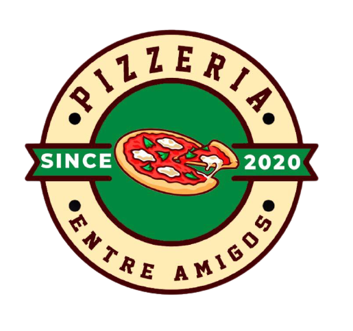

# Order Pizza Entre amigos web app

This project was made to help my brother's pizza shop in order to make easier get pizza orders by whatsapp or instagram asking to the people.
## [Project link](https://entreamigos.vercel.app/)  

# tools and tecnologies
1- REACTJS to develop the app
2- REACT ROUTER
3- PUSHERJS to make in real time the pizza orders module 
4- FIGMA to desing
5- HOWLER to push some sound efects when appear a new order

## steps to install the program
###  `npm install`
###  `npm install react-router-dom`
###  `npm install pusher`
###  `npm install howler`
 
## to run it
###  `npm start`

# then start the laravel serve
## [click here to see the backend](https://github.com/garcia98daniel/pizzaOrderApi)  

## Contributing
Pull requests are welcome. For major changes, please open an issue first to discuss what you would like to change.

